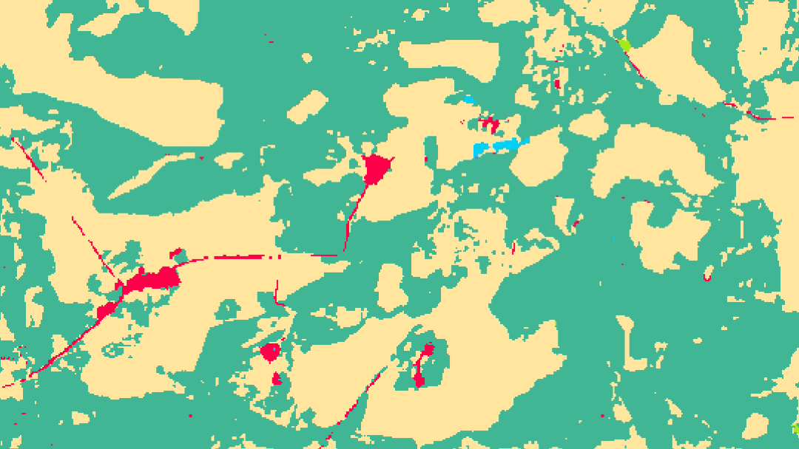

# Land-cover-change-analysis
Short code for land cover raster data analysis contains functions for reading, visualisation and analysis of land cover raster data. These functions are helpful when the tasks are
1) to compare two rasters and find the changes -- so where rasters are different -- in pixel based manner;
2) to estimate the distribution of changes, meaning which class has made the transition to which.

The main function of the tutorial is 'get_changes' function having raster paths as the inputs. It has an option of saving or not saving the comparision raster where pixels of class trasition are marked as the separate class.

  

